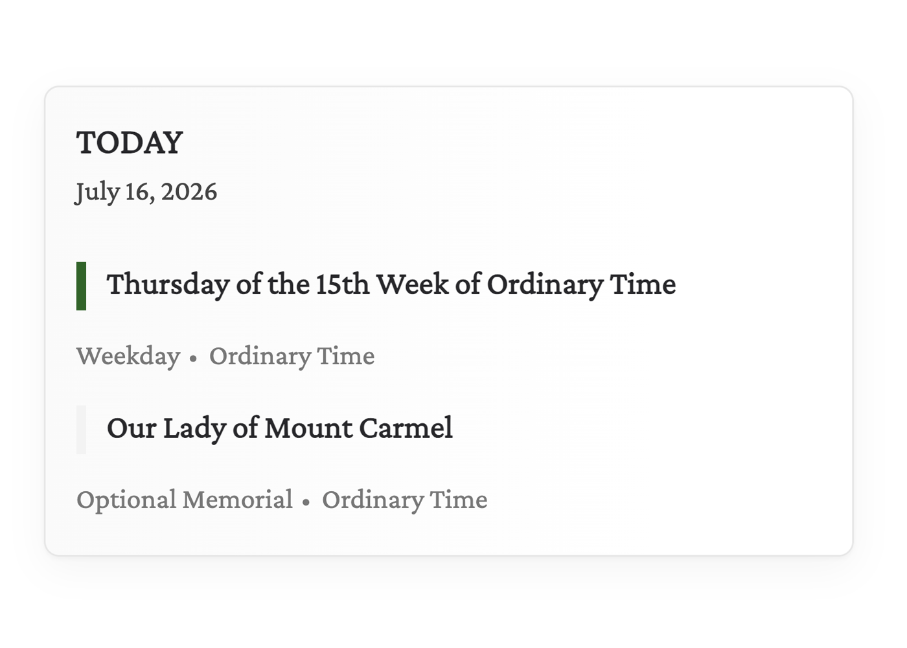

# My Catholic Calendar

A modern WordPress plugin that displays the **Catholic liturgical calendar** on any theme, powered by the [LitCal API](https://litcal.johnromanodorazio.com/).



> ⚠️ **Status:** early development (`0.1.0`). The REST API and the shipped block work, but the public contract isn't stable yet.

## Features

- 🕯️ **Day block** — displays today's Catholic liturgical celebration(s), including name, rank, and liturgical color. Fully server-rendered (`render.php`) for compatibility with any theme. (A month/grid calendar block is planned for a future release.)
- 🌍 **General Roman Calendar** — currently supports the General Roman Calendar. Support for national and diocesan calendars is planned for future releases.
- 🔌 **REST API** — a cached `kalenda/v1` namespace (`/calendar`, `/day`, `/calendars`) for accessing liturgical data. The browser never calls LitCal directly.
- ⚡ **Caching** — uses WordPress transients to reduce external API requests and improve performance.

## Architecture

Kalenda is a thin, well-isolated WordPress layer over the official
[`liturgical-calendar/components`](https://packagist.org/packages/liturgical-calendar/components) library.

- **`Kalenda\Contracts\LitCalGateway`** — the only interface anything talks to for calendar data.
- **`Kalenda\Api\LitCalClient`** — implements the gateway over the components library's `ApiClient`, with WordPress adapters for HTTP (`WpHttpClient`, over `wp_remote_request`) and caching (`TransientCache`, over WP transients).
- **`Kalenda\Repositories\CalendarRepository`** — validates a query against LitCal's live metadata allowlist, then fetches through the gateway, mapping an unavailable upstream to a REST-friendly error. Shared by the REST controller and the block's `render.php` (via the `kalenda()` helper).
- **`Kalenda\Services\DayService`** — filters a year's events down to a single day; shared the same way.
- **`kalenda/v1` REST endpoints** (`Kalenda\Rest\*`) proxy and cache LitCal for the block and for third parties.
- **Blocks** are dynamic/server-rendered (`render.php` + `block.json`), with an editor preview via `ServerSideRender`. There is no front-end JavaScript interactivity yet.

```
kalenda.php          Bootstrap: guards, autoload, boot; defines the kalenda() helper
src/                 PSR-4 (Kalenda\) — gateway, repositories/services, REST, blocks glue
blocks/              Block sources (built into build/ by @wordpress/scripts)
build/               Compiled block assets
assets/              Plugin icon assets
languages/           Translations
tests/               PHPUnit tests
```

## Requirements

- WordPress **6.5+**
- PHP **8.1+**

## Development

```bash
composer install        # PHP dependencies + autoloader
npm install             # block toolchain
npm run build           # compile blocks into build/
npm run start           # watch mode

composer run phpcs      # WordPress Coding Standards
composer run phpstan    # static analysis
composer run test       # PHPUnit

npm run env:start       # local WordPress via wp-env (requires Docker)
```

## License

[GPL-2.0-or-later](LICENSE). Liturgical data is provided by the LitCal project.
